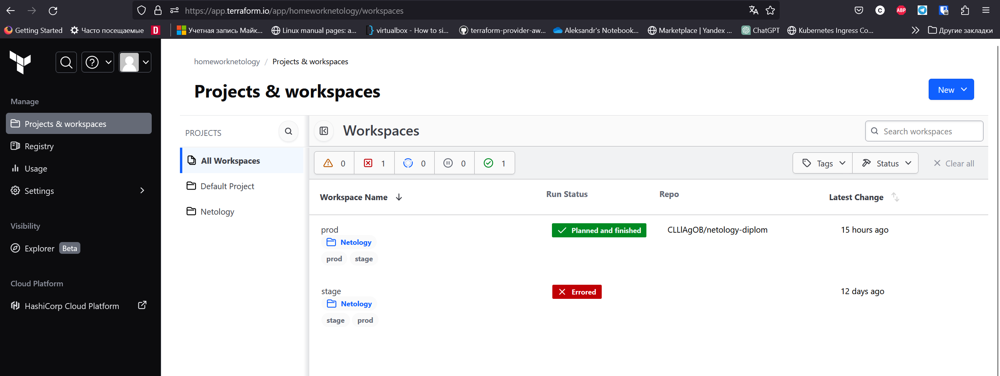
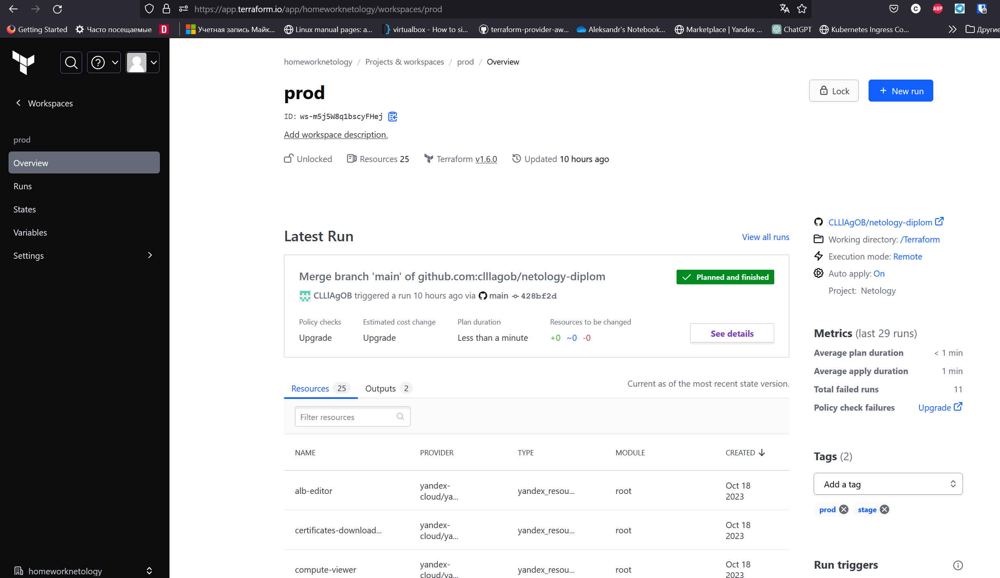
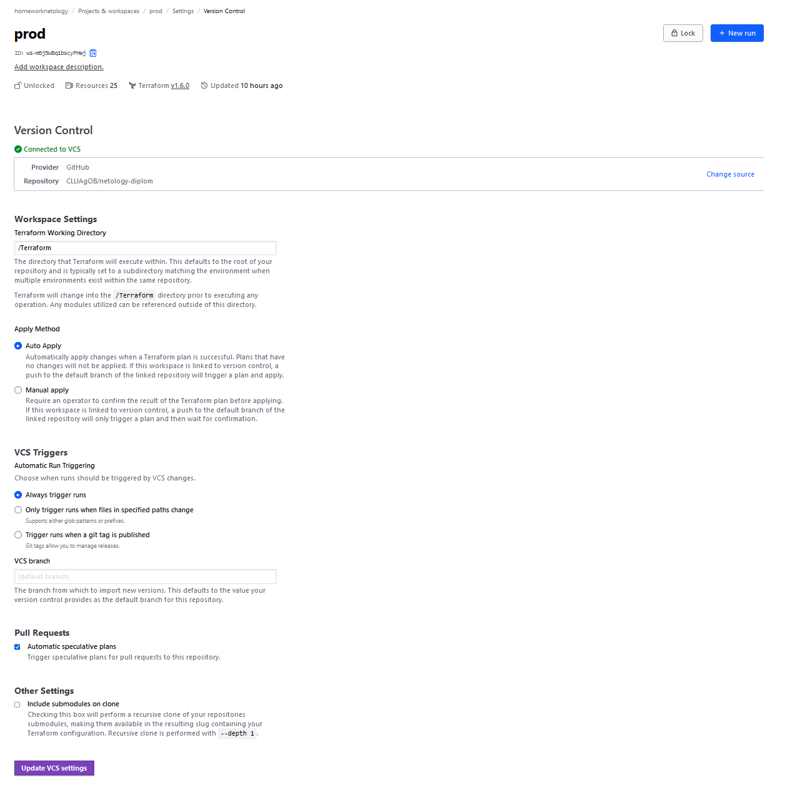
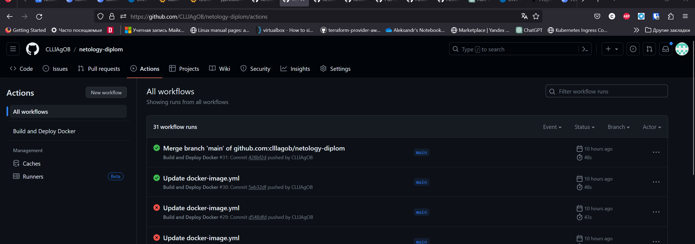

# netology-diplom

## Этапы выполнения:

### 1. Создание облачной инфраструктуры

Я выбрал облачное хранилище Terraform для автоматической сборки и хранения конфигурации. Ссылка на [репозиторий](https://github.com/CLLlAgOB/netology-diplom/tree/main/Terraform). Ниже представлены скриншоты.

### 2. Создание Kubernetes кластера

Я выбрал решение от Яндекс.Облака - Yandex Managed Service for Kubernetes, которое поднимается средствами Terraform. К сожалению, ALB7 еще не полностью автоматизирован и требует ручных действий, которые я описал [здесь](https://github.com/CLLlAgOB/netology-diplom/tree/main/Ingress%26ALB).

### 3. Создание тестового приложения

Это статичная веб-страничка, поднятая на Nginx. Ссылка на [репозиторий приложения](https://github.com/CLLlAgOB/netology-diplom/tree/main/Docker). Для развертывания использованы файлы qbec, доступные [здесь](https://github.com/CLLlAgOB/netology-diplom/tree/main/qbec/website). Приложение доступно по ссылке: [https://prod.clllagob.ru/myapp](https://prod.clllagob.ru/myapp).

### 4. Подготовка системы мониторинга и деплой приложения

Для системы мониторинга было решено использовать kube-prometheus. Ссылка на [репозиторий](https://github.com/CLLlAgOB/netology-diplom/tree/main/Monitoring). Графана доступна по ссылке: [https://prod.clllagob.ru/grafana/](https://prod.clllagob.ru/grafana/).

### 5. Установка и настройка CI/CD

Так как я использую GitHub, я решил попробовать GitHub Actions. Ссылка на [файл автоматизации](https://github.com/CLLlAgOB/netology-diplom/blob/main/.github/workflows/docker-image.yml). Ниже представлен скриншот работы.

